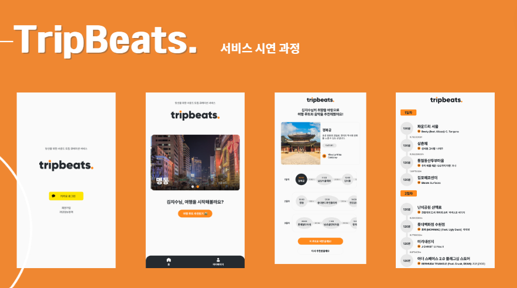
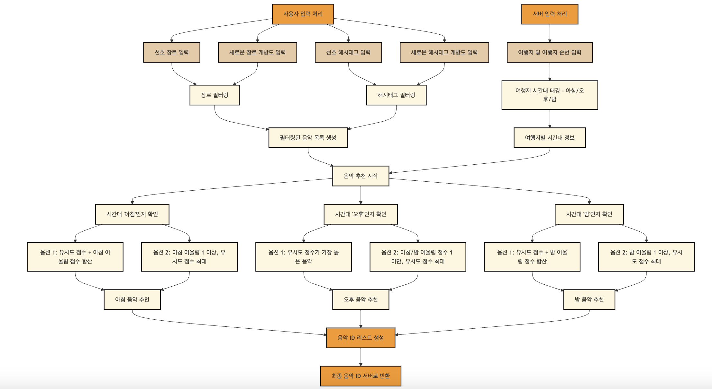
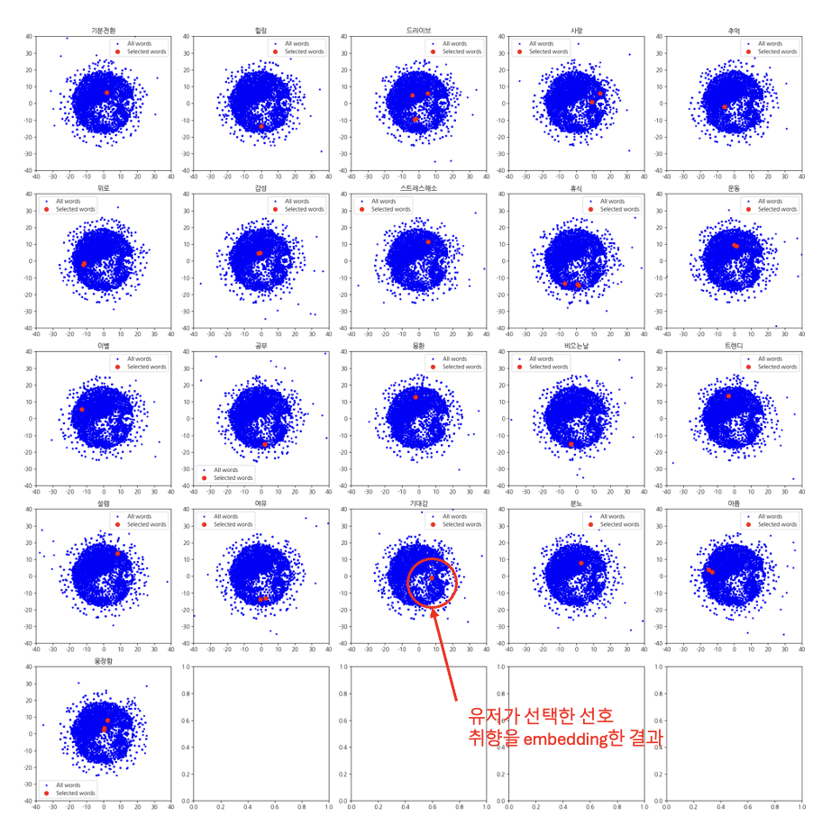
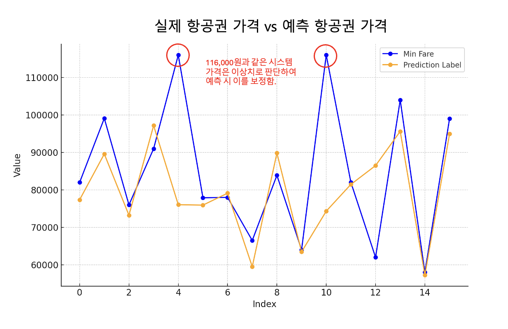
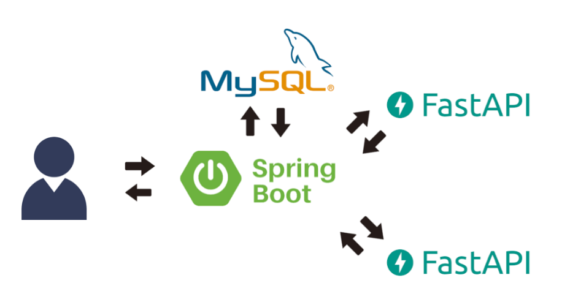
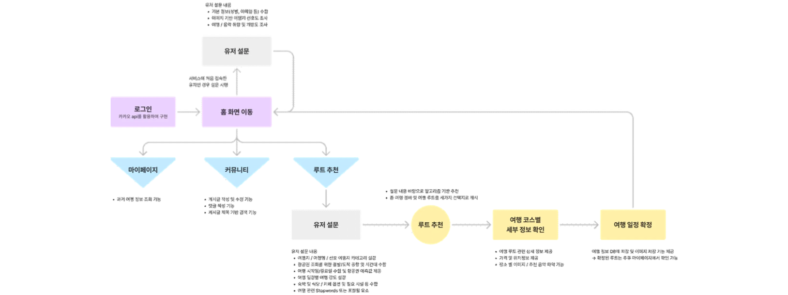
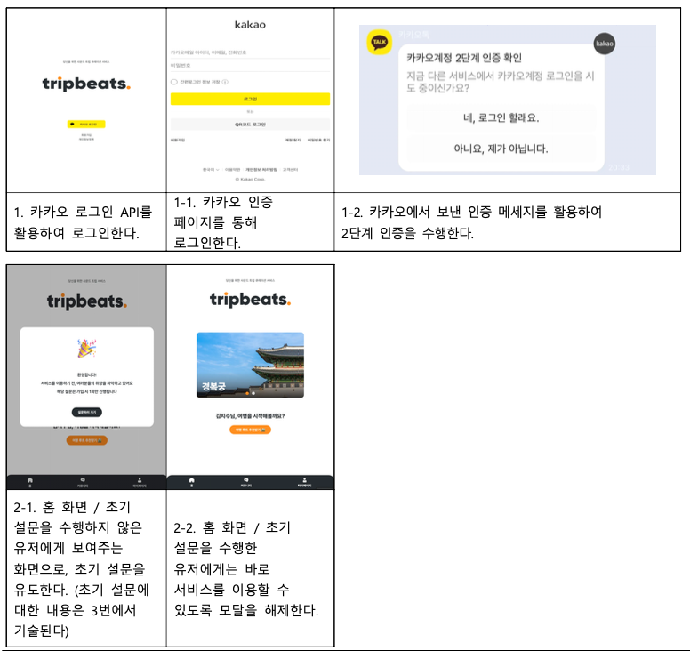
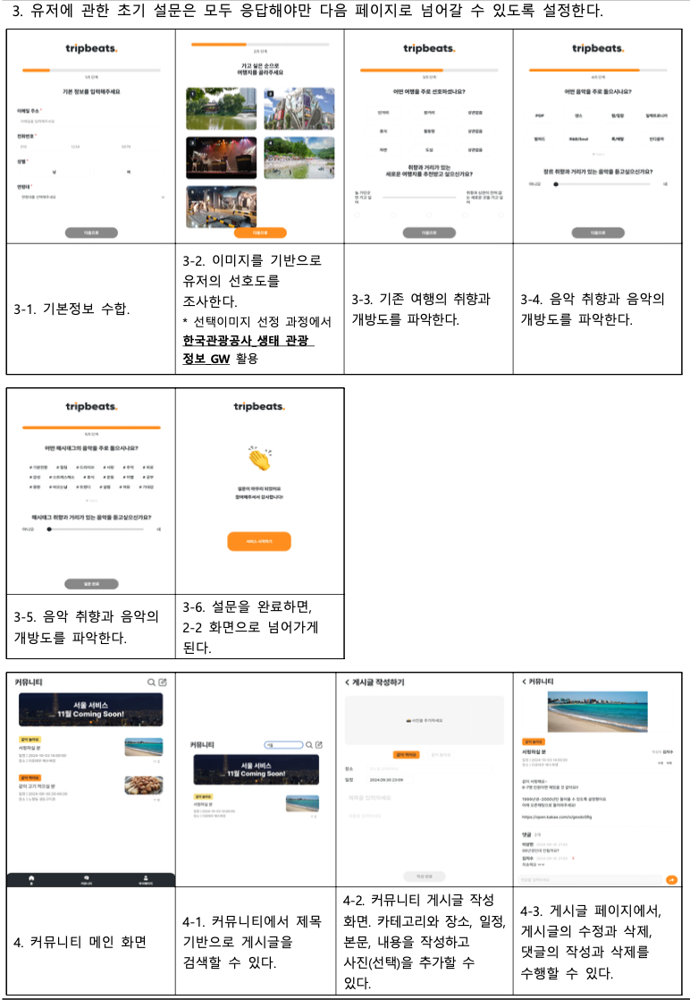
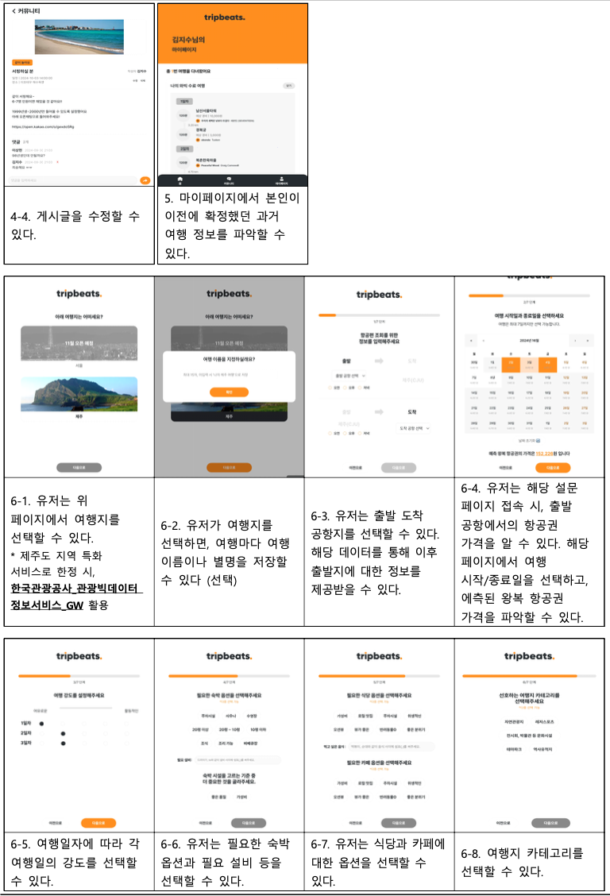
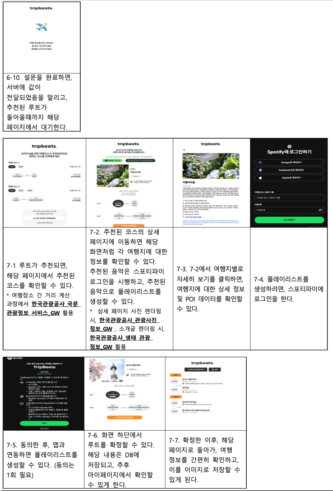

# TripBeats: 1인 여행객을 위한 개인 맞춤형 사운드 트립 서비스

TripBeats는 한국관광공사의 API를 활용하여 **1인 여행객의 입체적인 취향을 학습**하고, **개인 맞춤형 여행 코스**와 그에 어울리는 **음악 플레이리스트**를 함께 추천해주는 앱 서비스입니다. 여행지 추천부터 음악, 경비 계산, 커뮤니티 기능까지 제공하여 혼자 여행하는 이들에게 최적의 여행 경험을 선사합니다.

---

## 목차

1. [팀 소개](#팀-소개)
2. [서비스 개요](#서비스-개요)
3. [기획 배경](#기획-배경)
4. [주요 기능](#주요-기능)
   - [1. 여행 코스 추천 서비스](#1-여행-코스-추천-서비스)
   - [2. 여행지와 어울리는 음악 추천 서비스](#2-여행지와-어울리는-음악-추천-서비스)
   - [3. 여행 경비 제공 서비스](#3-여행-경비-제공-서비스)
   - [4. 커뮤니티 기능](#4-커뮤니티-기능)
   - [5. 마이페이지 기능](#5-마이페이지-기능)
5. [데이터 수집 및 활용](#데이터-수집-및-활용)
6. [모델링 및 알고리즘](#모델링-및-알고리즘)
   - [여행 코스 추천 모델링](#여행-코스-추천-모델링)
   - [여행지와 어울리는 음악 추천 알고리즘](#여행지와-어울리는-음악-추천-알고리즘)
   - [여행 경비 예측 모델링](#여행-경비-예측-모델링)
7. [구현 과정](#구현-과정)
   - [백엔드 아키텍처](#백엔드-아키텍처)
   - [프론트엔드 구현](#프론트엔드-구현)
8. [서비스 흐름도](#서비스-흐름도)
9. [향후 계획 및 사업화 방안](#향후-계획-및-사업화-방안)
10. [한계점 및 개선 방안](#한계점-및-개선-방안)
11. [시사점](#시사점)
12. [참고 자료](#참고-자료)

---

## 팀 소개

연세대학교 빅데이터 학회 **YBIGTA**

- **팀명**: TripBeats
- **프로젝트 기간**: 2024.04 ~ 2024.10 (예정)

**팀 구성원 및 역할**

1. **이윤이 (팀 대표)**
   - 역할: 서비스 기획, 데이터 수집 및 전처리, 모델링
2. **강민정**
   - 역할: 서비스 기획, 데이터 수집 및 전처리, 모델링
3. **김소민**
   - 역할: 서비스 기획, 데이터 수집 및 전처리, 모델링
4. **김지수**
   - 역할: UX/UI 디자인, 프론트엔드 개발
5. **양진성**
   - 역할: 서비스 기획, 데이터 수집 및 전처리, 모델링
6. **이상헌**
   - 역할: 백엔드 개발

---

## 서비스 개요

**TripBeats**는 혼자 여행하는 '혼행족'을 위한 개인 맞춤형 사운드 트립 서비스입니다. 사용자의 여행 취향과 음악 선호도를 종합적으로 분석하여 **최적의 여행 코스**와 그에 어울리는 **음악 플레이리스트**를 제공합니다. 또한, 여행 경비 계산 및 커뮤니티 기능을 통해 여행 계획부터 실행까지 전 과정을 지원합니다.

---

## 기획 배경

- ### **1인 여행객 증가 추세**

  코로나 이후 1인 여행은 새로운 여행 트렌드로 자리 잡았습니다. 1인 가구의 증가와 함께 개인 맞춤형 소비 활동을 선호하는 '혼코노미' 트렌드가 확산되면서 '혼행족'이 주요 소비층으로 떠오르고 있습니다.

- ### **맞춤형 여행 서비스의 필요성**

  정보의 홍수 속에서 개인의 취향을 종합적으로 고려한 여행 코스를 구상하기는 어려운 실정입니다. 기존의 여행 서비스들은 대개 대중적인 정보를 제공하는 데 그치며, 혼자 여행하는 이들을 위한 맞춤형 서비스는 부족합니다.

- ### **여행에서 음악의 중요성**

  여행 경험에서 음악은 중요한 요소로 작용합니다. 여행지의 분위기에 어울리는 음악은 여행의 감성을 배가시키며, MZ세대를 중심으로 여행과 음악을 결합한 서비스에 대한 수요가 증가하고 있습니다.

---

## 주요 기능

### 1. 여행 코스 추천 서비스

#### a. **AI 기반 사용자 맞춤형 장소 추천**

- **사용자 성향 분석**

  - 초기 설문 조사를 통해 사용자의 여행 취향, 선호하는 활동, 음식, 예산 등을 파악합니다.
  - 성별, 연령대, 여행 스타일 등을 고려하여 최적의 장소를 추천합니다.

- **카테고리별 장소 추천**

  - **카페**, **식당**, **숙소**, **관광지** 등 4개의 카테고리로 구분하여 각 카테고리별 최적의 장소를 제공합니다.
  - 예를 들어, 반려동물 동반 가능 여부, 위생 상태, 가격대 등 세부 조건까지 고려합니다.

#### b. **맞춤형 장소 추천을 기반으로 한 최적 코스 생성**

- **최적의 여행 코스 구성**

  - 장소 간 거리, 이동 시간, 운영 시간, 사용자 피로도 등을 종합적으로 고려합니다.
  - **유전 알고리즘**과 **다이나믹 알고리즘**을 활용하여 최적의 코스를 생성합니다.
  - 1인 여행객이 방문하기 적합한 장소에 가중치를 부여하여 추천합니다.

- **코스 재생성 및 세부 정보 제공**

  - 추천된 코스가 만족스럽지 않을 경우, **코스 재생성 기능**을 제공합니다.
  - 각 장소의 세부 정보(사진, 영업시간 등)를 확인할 수 있습니다.
  - 생성된 코스는 **마이페이지**에 저장하여 관리할 수 있습니다.

### 2. 여행지와 어울리는 음악 추천 서비스

#### a. **서비스 소개**

- 여행 코스에 맞춰 각 여행지에 어울리는 **음악을 추천**합니다.
- 사용자 선호 장르, 해시태그, 방문 시간대 등을 고려하여 음악을 **큐레이션**합니다.
- 음악과 여행지를 결합하여 더욱 **감성적인 여행 경험**을 제공합니다.

#### b. **주요 기능 및 알고리즘**

- **개인 맞춤형 음악 필터링**

  - 선호하는 음악 장르와 **개방도**를 설정하여 추천 가능한 음악 목록을 축소합니다.

- **시간대별 분위기에 맞는 음악 추천**

  - 여행지 방문 **시간대**(아침, 오후, 저녁)에 따라 어울리는 분위기의 음악을 추천합니다.

- **여행지와 음악 간 감성적 연결성 고려**

  - 여행지와 음악의 **해시태그**를 임베딩하여 코사인 유사도를 계산합니다.
  - **감성적 유사성**을 평가하여 최적의 음악을 추천합니다.

### 3. 여행 경비 제공 서비스

#### a. **서비스 소개**

- 선택한 여행 코스에 따른 **총 경비를 자동으로 계산**하여 제공합니다.
- **항공권**, **숙소**, **식비**, **렌터카**, **액티비티** 등 여행 요소별 가격 정보를 종합하여 현실적인 예산 설정을 돕습니다.
- 여행 경비를 세부 항목별로 확인할 수 있어 **지출 계획을 효과적으로 관리**할 수 있습니다.

#### b. **주요 기능**

- **항공권 가격 예측**

  - 여행 날짜 및 시간대에 따른 항공권 가격을 **머신러닝 모델**로 예측하여 달력에 시각화합니다.
  - 유저가 합리적인 여행 날짜를 선택할 수 있도록 돕습니다.

- **코스별 총 여행 경비 계산**

  - 추천된 여행 코스마다 항공권, 숙소, 식비, 렌터카, 액티비티 등 모든 경비를 합산하여 제공합니다.
  - 코스별 경비를 비교하여 **예산에 맞는 코스**를 선택할 수 있습니다.

- **유저 안내 메시지 제공**

  - 통계 데이터를 기반으로 평균 1인 여행객 경비 정보를 제공합니다.
  - 합리적인 소비 계획을 위한 **명확한 기준**을 제시합니다.

### 4. 커뮤니티 기능

#### a. **서비스 소개**

- 비슷한 관심사를 가진 1인 여행객들과 **실시간으로 모임을 생성**하고 정보를 교류할 수 있습니다.
- 여행 중에도 즉각적인 모임 생성과 참여가 가능하여 혼자 여행하는 이들에게 새로운 경험을 제공합니다.

#### b. **주요 기능**

- **실시간 모임 생성**

  - 여행 중 즉시 모임을 생성하고 참가자를 모집할 수 있습니다.
  - 기존 커뮤니티에서 제공하지 않는 **즉시성**과 **현장성**을 강조합니다.

- **모임 카테고리 분류**

  - "같이 먹어요", "같이 놀아요" 등 **세부 카테고리**로 모임을 분류하여 참여를 용이하게 합니다.

- **커뮤니티 기반 소셜 기능**

  - 게시글 작성, 댓글, 좋아요 등의 기능을 통해 적극적인 **상호작용**이 가능합니다.

### 5. 마이페이지 기능

#### a. **서비스 소개**

- 자신의 **여행 기록을 한눈에 확인**하고 관리할 수 있습니다.
- 총 여행 횟수, 다녀온 여행 목록, 세부 일정, 경비 등을 조회할 수 있습니다.

#### b. **주요 기능**

- **여행 기록 관리**

  - 총 여행 횟수를 표시하고, 최신순으로 여행 목록을 제공합니다.

- **여행 세부 정보 확인**

  - 각 여행의 세부 일정, 경비, 방문 장소 등을 상세히 확인할 수 있습니다.
  - 과거 여행 데이터를 기반으로 다음 여행 계획에 참고할 수 있습니다.

---

## 데이터 수집 및 활용

### **활용한 공공 데이터**

- **한국관광공사 Open API**

  - **국문 관광정보 서비스_GW**: 여행지, 숙소 등의 소개 정보
  - **관광빅데이터 정보서비스_GW**: 여행객 통계 및 트렌드 정보
  - **관광사진 정보_GW**: 여행지 사진 정보
  - **생태 관광 정보_GW**: 생태 관광지 및 태그 정보

- **한국문화관광연구원**

  - **관광실태조사서비스**: 여행객의 행동 및 소비 패턴 데이터

### **음악 데이터 수집**

- **Spotify API**

  - 음악 정보(가수, 곡명, 장르, 가사), 오디오 피처 수집

- **OpenAI GPT 활용**

  - 여행지 및 음악에 대한 **해시태그 생성**
  - **감성적 특성 추론**

### **추가 데이터**

- **항공권 데이터**

  - 네이버 항공권의 1년치 항공권 데이터 수집
  - 날짜별, 시간대별, 항공사별 최저가 데이터 활용

- **액티비티 가격 정보**

  - 비짓제주 액티비티 가격 정보 수집

- **통계 자료**

  - **2023년 제주특별자치도 방문관광객 실태조사**: 1인 여행객 평균 경비 등

---

## 모델링 및 알고리즘

### **여행 코스 추천 모델링**

#### a. **사용자 맞춤형 장소 추천**

- **유저 간 유사도 기반 추천**

  - 유사한 여행 취향을 가진 여행객의 데이터를 활용하여 장소를 추천합니다.
  - 만족도, 재방문 의사 등을 예측하여 **'TOTAL_SCORE'**를 산출합니다.
  - **베이지안 회귀분석**을 통해 불확실성을 고려한 예측을 수행합니다.

- **장소 간 유사도 기반 추천**

  - 여행지의 소개글과 리뷰를 **Word2Vec**으로 벡터화하여 장소 간 유사도를 계산합니다.
  - 장소별 네트워크를 구성하고, **중심성**을 계산하여 추천에 활용합니다.

- **Rule-based Filtering**

  - 사용자의 자유 서술형 입력을 **LLM**을 활용하여 필터링에 적용합니다.
  - 예를 들어, '물이 싫다' 등의 입력을 통해 관련 장소를 배제합니다.

#### b. **최적 코스 생성**

- **알고리즘 활용**

  - **유전 알고리즘**을 기본으로 하며, 속도 향상을 위해 **다이나믹 알고리즘**을 추가 적용합니다.
  - 여행 코스의 다양한 요소(거리, 피로도, 장소 조건 등)를 고려하여 **Fitness Score**를 계산합니다.

### **여행지와 어울리는 음악 추천 알고리즘**

- 

#### a. **데이터 및 모델**

- **데이터셋**

  - 여행지 소개 정보: 한국관광공사 API 활용
  - 음악 정보: Spotify API 활용

- **임베딩 모델**

  - **KoSimCSE-roberta**, **gte-large-en-v1.5** 등 다양한 모델을 비교하여 최적 모델을 선정

#### b. **추천 알고리즘**

- **해시태그 기반 유사도 측정**

  - 여행지와 음악에 대한 **해시태그**를 생성하고, 이를 임베딩하여 코사인 유사도를 계산합니다.
  - **감성적 유사성**을 평가하여 어울리는 음악을 추천합니다.

- **개인 맞춤형 음악 필터링**

  - 사용자 선호 장르와 해시태그, 개방도 등을 고려하여 음악 목록을 축소합니다.
  - **FAISS 라이브러리**를 활용하여 빠른 유사도 검색을 구현합니다.
  - 

- **시간대별 어울림 점수 적용**

  - 방문 시간대에 따라 음악의 분위기를 고려하여 **가중치**를 부여합니다.
  - Spotify의 오디오 피처와 클러스터링을 통해 시간대별 어울림 정도를 계산합니다.

### **여행 경비 예측 모델링**

#### a. **항공권 가격 예측**

- **데이터 전처리**

  - **이상치 제거**: 비정상적으로 높거나 낮은 항공권 가격 제거
  - **예측 변수 선정**: 날짜, 요일, 항공사, 비행 시간대 등

- **모델링**

  - **XGBoost**와 **LightGBM 앙상블 블렌딩**을 통해 예측 성능 향상
  - 회귀 모델 평가 지표(MSE, RMSE, RMSLE, MAPE 등)를 활용하여 성능 검증
  - 

#### b. **코스별 총 경비 계산**

- **가격 정보 활용**

  - **항공권**: 예측된 가격 사용
  - **숙소**, **액티비티**: 수집한 실제 가격 데이터 활용
  - **식비**, **렌터카**: 통계자료 기반으로 예상 경비 산출

---

## 구현 과정

### **백엔드 아키텍처**

- **Spring Boot 서버**

  - 클라이언트 요청을 받아 필요한 로직을 처리합니다.
  - 모델 인퍼런스가 필요한 경우 **FastAPI 서버**로 요청을 전달합니다.

- **FastAPI 인퍼런스 서버**

  - 머신러닝 모델을 사용하여 인퍼런스 작업을 수행합니다.
  - 결과를 Spring Boot 서버로 반환합니다.

- **서버 간 통신**

  - **클라이언트** → **Spring Boot 서버** → **FastAPI 서버** → **Spring Boot 서버** → **클라이언트** 순으로 데이터 흐름이 이루어집니다.

### **프론트엔드 구현**

- **React 기반 UI/UX**

  - 직관적이고 사용하기 쉬운 **컴포넌트**로 구성하였습니다.
  - 사용자 경험(UX)을 고려하여 최소한의 단계로 원하는 결과를 얻을 수 있도록 설계하였습니다.
  - **시각적 효과**를 통해 사용자 친화적인 인터페이스를 구현하였습니다.

---

## 서비스 흐름도

1. **카카오 로그인**

   - **카카오 로그인 API**를 활용하여 사용자 인증을 진행합니다.

2. **초기 설문 진행**

   - 사용자 기본 정보 및 여행/음악 취향을 파악하기 위한 **설문**을 실시합니다.
   - 이미지 기반 선호도 조사, 여행 스타일, 음악 취향 및 개방도 등을 수집합니다.

3. **여행 코스 및 경비 추천**

   - 설문 결과를 기반으로 개인 맞춤형 **여행 코스**와 **경비**를 추천합니다.
   - 여행 날짜 선택 시 **항공권 가격 예측** 정보를 제공합니다.

4. **음악 플레이리스트 생성**

   - 추천된 여행지와 어울리는 **음악 플레이리스트**를 생성합니다.
   - **Spotify API**를 통해 사용자의 Spotify 계정에 플레이리스트를 생성할 수 있습니다.

5. **커뮤니티 및 마이페이지 이용**

   - 여행자 간 정보 공유 및 **실시간 모임 생성**이 가능합니다.
   - **마이페이지**에서 여행 기록 및 확정된 코스를 관리할 수 있습니다.

---

## 향후 계획 및 사업화 방안

### **향후 계획**

- **서비스 지역 확대**

  - 초기에는 **제주도**에 특화된 서비스를 제공하며, 이후 **전국으로 확대**할 예정입니다.

- **다국어 지원**

  - 외국인 관광객을 위한 **다국어 지원** 기능을 추가할 계획입니다.

- **데이터 업데이트 및 모델 개선**

  - 지속적인 데이터 수집과 모델 업데이트를 통해 **추천 성능**을 향상시킬 예정입니다.

### **사업화 방안**

- **지자체 및 업체와의 협업**

  - 지자체의 **관광지 홍보**를 유도하고, 지역 축제 기간에 음식점 등의 **배너 광고**를 제공합니다.

- **프리미엄 서비스 도입**

  - 맞춤형 **컨시어지 서비스**, **VIP 전용 코스 추천** 등 부가 서비스로 수익 모델을 구축합니다.

- **음악 플랫폼과의 제휴**

  - **Spotify** 등 음악 플랫폼과의 제휴를 통해 음악 추천 서비스를 강화하고, **공동 마케팅**을 추진합니다.

---

## 한계점 및 개선 방안

### **한계점**

- **데이터 수집의 한계**

  - 전국적인 데이터 커버리지가 부족하여 서비스 확장 시 기술적, 운영적 문제가 발생할 수 있습니다.

- **서비스 확장성**

  - 이동 수단(도보, 대중교통, 차량 등)에 따른 추천의 다각화 기능이 필요합니다.
  - 사용자 피드백에 따른 모델 성능의 실시간 개선 기능이 부족합니다.

### **개선 방안**

- **데이터 업데이트**

  - 지속적인 데이터 수집과 업데이트를 통해 전국적인 서비스로 확장할 예정입니다.

- **기능 추가 및 개선**

  - 이동 수단별 코스 추천 기능을 개발하고, 사용자 피드백 시스템을 구축하여 모델을 개선합니다.
  - 실시간 여행 중인 유저를 위한 부가 기능(예: 실시간 날씨 정보, 이벤트 알림 등)을 추가합니다.

---

## 시사점

1. **관광 산업 활성화**

   - 맞춤형 여행 코스와 가격 경쟁력 있는 상품 구성을 통해 여행객의 만족도를 높입니다.
   - **내수 경제 활성화**에 기여할 수 있습니다.

2. **지역 경제 활성화**

   - 지역 간 협력을 통한 **연계형 관광 상품 출시**를 유도합니다.
   - 소상공인 매출 상승에 기여합니다.

3. **음원 시장 활성화**

   - 지역 관련 음원 디렉팅을 통해 음원 매출 상승에 기여합니다.
   - 외국인 여행객의 **K-pop 감상**을 유도하여 한국 음원 시장의 해외 진출에 기여합니다.

---

## 참고 자료

- **TripBeats 공식 웹사이트**: [https://www.tripbeats.site](https://www.tripbeats.site)
- **한국관광공사 Open API**: [https://api.visitkorea.or.kr](https://api.visitkorea.or.kr)
- **한국문화관광연구원 관광실태조사서비스**: [https://www.kcti.re.kr](https://www.kcti.re.kr)
- **Spotify for Developers**: [https://developer.spotify.com](https://developer.spotify.com)

---

더욱 풍부한 여행 경험을 원하신다면 TripBeats와 함께하세요!

**앱 다운로드/서비스 URL**: [https://www.tripbeats.site](https://www.tripbeats.site)

